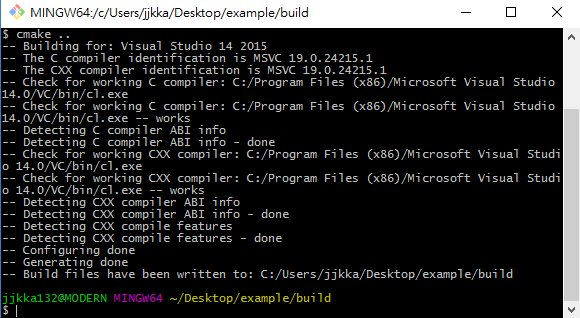
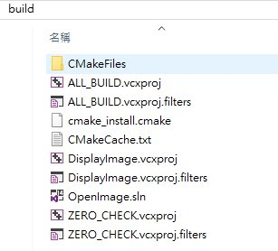

# 利用CMake在Windows環境下快速建立OpenCV專案
>By Jacky Liu
>27 Dec 2016

在windows下開新的OpenCV專案每次都要手動設定dll、lib等等相關路徑，懶人如我，設定兩次後就不耐煩了，到底有沒有更快的方式，快速建立專案？而解方就是使用CMake

## 環境
 - Microsoft Windows 10
 - Visual studio 2015
 - OpenCV 3.2
   - 安裝路徑：c:\opencv
 - Cmake 3.7.1

## 步驟
1. 建立專案資料夾example
2. 在example資料夾中建立OpenCV程式碼文件
DisplayImage.cpp
    ```cpp
    #include <stdio.h>
    #include <opencv2/opencv.hpp>

    using namespace cv;

    int main(int argc, char** argv )
    {
        if ( argc != 2 )
        {
            printf("usage: DisplayImage.out <Image_Path>\n");
            return -1;
        }

        Mat image;
        image = imread( argv[1], 1 );

        if ( !image.data )
        {
            printf("No image data \n");
            return -1;
        }
        namedWindow("Display Image", WINDOW_AUTOSIZE );
        imshow("Display Image", image);

        waitKey(0);

        return 0;
    }
    ```
3. 在example資料夾中建立CMakeLists.txt
    ```cmake
    cmake_minimum_required(VERSION 2.8)

     project(OpenImage) 
        MACRO(MY_DEFINE_EXAMPLE name srcs) 
            add_executable(${name} ${srcs}) 

            # 設定 include path 
            include_directories("." 
            "C:\\opencv\\build\\include" 
            "C:\\opencv\\build\\include\\opencv" 
            "C:\\opencv\\build\\include\\opencv2") 

            # 設定 library path (自己編譯出來的 OpenCV library 位置) 
            set(MYLIBPATH "C:\\opencv\\build\\x64\\vc14\\lib\\") 
            target_link_libraries(${name} ${MYLIBPATH}opencv_world320d.lib)

           # 使用 Unicode 
            add_definitions(-DUNICODE -D_UNICODE) 
        ENDMACRO(MY_DEFINE_EXAMPLE)

        MY_DEFINE_EXAMPLE(DisplayImage     DisplayImage.cpp)
    ```
4. 在Command-line中cd至example資料夾下 (安裝cmake時需將cmake加到path中)	
    ```bash
    cd example
    mkdir build
    cd build
    cmake.exe -G "Visual Studio 14 2015 Win64" ..
    ```
成功完成Cmake

5. 在build資料夾中應出現以下檔案，開啟OpenImage.sln並對"DisplayImage"按下右鍵編譯

7.  編譯成功後在 `example/build/Debug`中會出現 DisplayImage.exe
8.  複製 `opencv_world320d.dll`與`lena.jpg`至同資料夾中
9.  用以下指令執行 DisplayImage.exe
	```bash
    ./DisplayImage.exe lena.jpg
    ```
10. 執行結果如下


